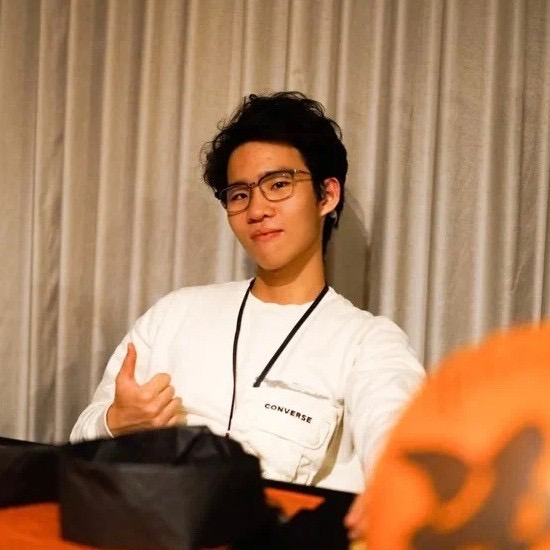

## About Me

I am a final-year undergraduate majoring in Computer Science at Northwestern University, with broad interest in Computational Linguistics and Natural Language Processing. 

Starting from the past summer, I am fortunate to work as a research assistant at [TTIC](https://www.ttic.edu/), supervised by Prof. [Zhewei Sun](https://zhewei-sun.github.io/). I also serve as a member of [LingMechLab](https://sites.northwestern.edu/lingmechlab/) and [MLL-Lab](https://mll-lab-nu.github.io/) at Northwestern, mentored by the gorgeous [Qingcheng Zeng](https://qcznlp.github.io/) and [Zihan Wang](https://zihanwang314.github.io/), respectively. 

## Research Interest

I am interested in how we can evaluate, interpret, and (hopefully) improve current AI systems. Much of my work is driven by linguistics (especially pragmatics) and cognitive science perspectives. I am also interested in multilinguality and how models understand and handle low-resource languages.

[This post](https://seantrott.substack.com/p/so-you-want-to-be-an-llm-ologist) has profoundly shaped my research perspective and current work.

## Publications

### Conference Papers

**The Pragmatic Mind of Machines: Tracing the Emergence of Pragmatic Competence in Large Language Models**  
Kefan Yu, Qingcheng Zeng, Weihao Xuan, Wanxin Li, Jingyi Wu, Rob Voigt  
**EACL main conference, 2026**. [[Paper](https://arxiv.org/abs/2505.18497)]  
*Also presented at [COLM 2025 Workshop: PragLM](https://sites.google.com/berkeley.edu/praglm/)*

### Preprints

**RAGEN: Understanding Self-Evolution in LLM Agents via Multi-Turn Reinforcement Learning**  
Zihan Wang, Kangrui Wang, Qineng Wang, Pingyue Zhang, Linjie Li, Zhengyuan Yang, Xing Jin, Kefan Yu, Minh Nhat Nguyen, Licheng Liu, Eli Gottlieb, Yiping Lu, Kyunghyun Cho, Jiajun Wu, Li Fei-Fei, Lijuan Wang, Yejin Choi, Manling Li  
arXiv preprint, 2025. [[Paper](https://arxiv.org/abs/2504.20073)]

## Miscellanea
I do some workouts, watch some anime, and listen to some JPOP.

Would greatly appreciate if you check [ずっと真夜中でいいのに。(ZUTOMAYO)](https://zutomayo.net/) out.